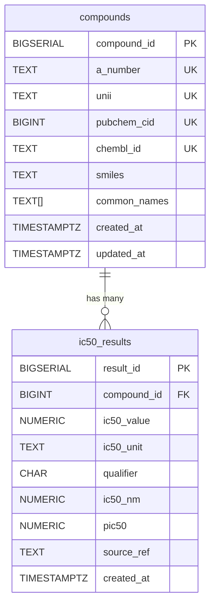

# hERG IC50 Database

Minimal SQL-first system for storing hERG IC50 data with:
- PostgreSQL database
- Automatic `ic50_nm` normalization + `pIC50` calculation
- Minimal Streamlit frontend for data entry and browsing

## 1. What This Repository Contains

```text
.
|-- docker-compose.yml
|-- .env.example
|-- deploy/
|   `-- Caddyfile
|-- db/
|   `-- init/
|       `-- 001_schema.sql
`-- app/
    |-- Dockerfile
    |-- requirements.txt
    `-- app.py
```

## 2. MVP Schema

Two tables only:
- `compounds`
  - `compound_id` (PK)
  - `a_number` (UNIQUE, nullable)
  - `unii` (UNIQUE, nullable)
  - `pubchem_cid` (UNIQUE, nullable)
  - `chembl_id` (UNIQUE, nullable)
  - `smiles` (optional)
  - `common_names` (`text[]`, list of aliases/common names)
  - `created_at`, `updated_at`
  - rule: at least one identifier must be present
- `ic50_results`
  - `result_id` (PK)
  - `compound_id` (FK -> `compounds.compound_id`)
  - `ic50_value` (> 0)
  - `ic50_unit` (`pM`, `nM`, `uM`, `mM`)
  - `qualifier` (`=`, `<`, `>`)
  - `ic50_nm` (derived in DB trigger)
  - `pic50` (derived in DB trigger)
  - `source_ref` (optional)
  - `created_at`

Helper function:
- `register_compound(...)`
  - finds existing compound by any provided identifier
  - creates new row if no match
  - updates missing identifiers/aliases on an existing match
  - returns canonical `compound_id`

### Schema Diagram



Notes:
- `compound_id` is assigned automatically.
- `register_compound(...)` deduplicates compounds across identifiers and returns the canonical `compound_id`.
- `ic50_nm` and `pic50` are computed in the database trigger.

## 3. Local Run (Create + Start)

### Prerequisites
- Docker + Docker Compose plugin installed

### Steps
1. Create local environment file:
```powershell
Copy-Item .env.example .env
```
2. Update `.env` if needed (especially `POSTGRES_PASSWORD`).
   - For local-only use, set `APP_DOMAIN=localhost`
3. Build and start services:
```powershell
docker compose up -d --build
```
4. Open the frontend:
- Direct app port: `http://localhost:8501`
- Via domain (after DNS + port-forward setup): `https://<APP_DOMAIN>`

### Check running services
```powershell
docker compose ps
```

### Check database tables
```powershell
docker compose exec db sh -lc 'psql -U "$POSTGRES_USER" -d "$POSTGRES_DB" -c "\dt"'
```

### Check reverse proxy logs
```powershell
docker compose logs -f caddy
```

## 4. Basic Workflow in UI

1. Add compounds with at least one identifier (`A-number`, `UNII`, `PubChem CID`, or `ChEMBL ID`)
2. Optionally include `SMILES` and comma-separated aliases/common names
3. Add IC50 results linked to a compound
4. Use `Upload CSV` tab for bulk imports
5. Use `Dashboard` tab to visualize entry counts and distributions
6. Browse/download recent results as CSV

`ic50_nm` and `pIC50` are automatically computed by PostgreSQL on insert/update.

## 5. Populate the Database

Use one of the options below depending on data volume.

### Option A: Populate via Frontend UI (small batches)
1. Open `http://localhost:8501`
2. In `Add Compound`, enter at least one identifier, then save
3. In `Add IC50 Result`, choose the compound and enter result fields
4. Confirm in `Browse Results`

### Option A2: Populate via Frontend CSV Upload (recommended)
1. Open `http://localhost:8501` and go to `Upload CSV`
2. Download CSV templates from the page (optional)
3. Upload compounds file with columns:
   - `a_number, unii, pubchem_cid, chembl_id, smiles, common_names`
4. Upload IC50 file with columns:
   - `id_type, id_value, ic50_value, ic50_unit, qualifier, source_ref`
5. Review row-level import summary/errors shown in UI

Notes:
- `common_names` can be pipe-separated (`name1|name2`) or comma-separated.
- `id_type` must be one of: `a_number`, `unii`, `pubchem_cid`, `chembl_id`.

Dashboard includes:
- summary metrics (`compounds`, `entries`, `compounds with results`, first/latest entry dates)
- qualifier and unit distributions
- pIC50 and log10(IC50 nM) histograms
- entries-over-time trend and top compounds by entry count

### Option B: Populate with SQL in `psql` (scriptable)
1. Open a database shell:
```powershell
docker compose exec db sh -lc 'psql -U "$POSTGRES_USER" -d "$POSTGRES_DB"'
```
2. Register compounds (auto-assigning `compound_id`):
```sql
SELECT register_compound(
  p_a_number => 'A-0001',
  p_unii => NULL,
  p_pubchem_cid => 702,
  p_chembl_id => 'CHEMBL545',
  p_smiles => 'CCO',
  p_common_names => ARRAY['ethanol', 'ethyl alcohol']
);

SELECT register_compound(
  p_a_number => NULL,
  p_unii => 'RZVAJINKPMORJF-UHFFFAOYSA-N',
  p_pubchem_cid => 1983,
  p_chembl_id => 'CHEMBL112',
  p_smiles => NULL,
  p_common_names => ARRAY['acetaminophen', 'paracetamol']
);
```
3. Insert IC50 results by identifier lookup:
```sql
INSERT INTO ic50_results (compound_id, ic50_value, ic50_unit, qualifier, source_ref)
SELECT c.compound_id, v.ic50_value, v.ic50_unit, v.qualifier, v.source_ref
FROM (
  VALUES
    ('CHEMBL545'::text, 125.0::numeric, 'nM'::text, '='::char(1), 'internal_run_001'::text),
    ('CHEMBL112'::text, 0.85::numeric, 'uM'::text, '<'::char(1), 'internal_run_001'::text)
) AS v(chembl_id, ic50_value, ic50_unit, qualifier, source_ref)
JOIN compounds c ON UPPER(c.chembl_id) = UPPER(v.chembl_id);
```

Note: `ic50_nm` and `pic50` are filled automatically by DB trigger logic.

### Option C: Bulk load from CSV (recommended for larger batches)
1. Create `compounds.csv`:
```csv
a_number,unii,pubchem_cid,chembl_id,smiles,common_names
A-0001,,702,CHEMBL545,CCO,ethanol|ethyl alcohol
,RZVAJINKPMORJF-UHFFFAOYSA-N,1983,CHEMBL112,,acetaminophen|paracetamol
```
2. Create `ic50_results.csv`:
```csv
id_type,id_value,ic50_value,ic50_unit,qualifier,source_ref
chembl_id,CHEMBL545,125,nM,=,internal_run_001
chembl_id,CHEMBL112,0.85,uM,<,internal_run_001
```
3. Copy CSV files into the DB container:
```powershell
docker compose cp .\compounds.csv db:/tmp/compounds.csv
docker compose cp .\ic50_results.csv db:/tmp/ic50_results.csv
```
4. Open `psql` and run:
```sql
CREATE TEMP TABLE staging_compounds (
  a_number text,
  unii text,
  pubchem_cid text,
  chembl_id text,
  smiles text,
  common_names text
);

\copy staging_compounds FROM '/tmp/compounds.csv' WITH (FORMAT csv, HEADER true);

SELECT register_compound(
  p_a_number => NULLIF(BTRIM(s.a_number), ''),
  p_unii => NULLIF(BTRIM(s.unii), ''),
  p_pubchem_cid => CASE
    WHEN NULLIF(BTRIM(s.pubchem_cid), '') IS NULL THEN NULL
    ELSE CAST(s.pubchem_cid AS BIGINT)
  END,
  p_chembl_id => NULLIF(BTRIM(s.chembl_id), ''),
  p_smiles => NULLIF(BTRIM(s.smiles), ''),
  p_common_names => CASE
    WHEN NULLIF(BTRIM(s.common_names), '') IS NULL THEN ARRAY[]::TEXT[]
    ELSE REGEXP_SPLIT_TO_ARRAY(s.common_names, '\|')
  END
)
FROM staging_compounds
AS s;

CREATE TEMP TABLE staging_ic50 (
  id_type text,
  id_value text,
  ic50_value numeric,
  ic50_unit text,
  qualifier char(1),
  source_ref text
);

\copy staging_ic50 FROM '/tmp/ic50_results.csv' WITH (FORMAT csv, HEADER true);

INSERT INTO ic50_results (compound_id, ic50_value, ic50_unit, qualifier, source_ref)
SELECT c.compound_id, s.ic50_value, s.ic50_unit, s.qualifier, NULLIF(BTRIM(s.source_ref), '')
FROM staging_ic50 s
JOIN compounds c ON
  (LOWER(s.id_type) = 'a_number' AND LOWER(c.a_number) = LOWER(s.id_value)) OR
  (LOWER(s.id_type) = 'unii' AND LOWER(c.unii) = LOWER(s.id_value)) OR
  (LOWER(s.id_type) = 'chembl_id' AND LOWER(c.chembl_id) = LOWER(s.id_value)) OR
  (LOWER(s.id_type) = 'pubchem_cid' AND c.pubchem_cid = CAST(s.id_value AS BIGINT));
```

### Verify loaded data
```sql
SELECT COUNT(*) AS compounds_n FROM compounds;
SELECT COUNT(*) AS results_n FROM ic50_results;
SELECT
  r.result_id,
  r.compound_id,
  c.a_number,
  c.unii,
  c.pubchem_cid,
  c.chembl_id,
  c.common_names,
  r.ic50_value,
  r.ic50_unit,
  r.ic50_nm,
  r.pic50
FROM ic50_results r
JOIN compounds c ON c.compound_id = r.compound_id
ORDER BY r.result_id DESC
LIMIT 10;
```

### Option D: Automated ChEMBL hERG Ingestion Script
Use the included script to pull hERG IC50 data (`CHEMBL240`) from ChEMBL and load it automatically.

1. Rebuild/start services (so script is available in container):
```powershell
docker compose up -d --build
```
2. Dry run first (no DB writes):
```powershell
docker compose exec frontend python /app/scripts/ingest_chembl_herg.py --dry-run
```
3. Run real ingestion:
```powershell
docker compose exec frontend python /app/scripts/ingest_chembl_herg.py
```

What the script does:
- pulls ChEMBL activities for target `CHEMBL240`, type `IC50`
- registers compounds via `register_compound(...)` using `chembl_id`
- inserts `ic50_results` with normalized `ic50_value` in `nM`
- stores provenance in `source_ref` as `ChEMBL:activity_id=<id>;...`
- skips already-ingested ChEMBL activity IDs for idempotent reruns

Useful flags:
```text
--max-activities 1000         # test with subset
--activity-page-size 1000     # API pagination size
--molecule-batch-size 150     # molecule metadata fetch chunk
--target-chembl-id CHEMBL240  # default hERG target
```

Automation:
- Schedule this command weekly/monthly in CI or cron:
```powershell
docker compose exec frontend python /app/scripts/ingest_chembl_herg.py
```

### Option E: Automated PubChem hERG Ingestion Script
Use the included script to pull hERG IC50-like rows from PubChem concise bioactivity data.

1. Rebuild/start services (so script is available in container):
```powershell
docker compose up -d --build
```
2. Dry run first (no DB writes):
```powershell
docker compose exec frontend python /app/scripts/ingest_pubchem_herg.py --dry-run
```
3. Run real ingestion:
```powershell
docker compose exec frontend python /app/scripts/ingest_pubchem_herg.py
```

What the script does:
- reads PubChem concise assay feed for gene symbol `KCNH2`
- filters to `Target GeneID=3757` and `Activity Name` matching `IC50`
- converts `Activity Value [uM]` to `nM`
- registers compounds via `register_compound(...)` using `pubchem_cid`
- inserts `ic50_results` with source tags like `PubChem:AID=...;SID=...;CID=...`
- skips already-ingested PubChem rows on rerun

Useful flags:
```text
--target-gene-symbol KCNH2
--target-gene-id 3757
--activity-name-regex '(?i)\\bic50\\b'
--max-activities 2000
--cid-batch-size 150
```

Automation:
- Schedule this command weekly/monthly in CI or cron:
```powershell
docker compose exec frontend python /app/scripts/ingest_pubchem_herg.py
```

## 6. Stop, Restart, Reset

Stop containers:
```powershell
docker compose down
```

Restart:
```powershell
docker compose up -d
```

Reset all data (destructive):
```powershell
docker compose down -v
docker compose up -d --build
```

## 7. Deploy Options

### Option A: Single VM (fastest)
1. Install Docker on server
2. Copy repository to server
3. Create `.env`
4. Run:
```bash
docker compose up -d --build
```
5. Reverse-proxy `frontend` (port 8501) with Nginx/Caddy if needed

### Option B: Managed PostgreSQL + App Container
1. Create managed Postgres instance
2. Run `db/init/001_schema.sql` against that instance
3. Deploy `app/` as a container service
4. Set `DB_HOST`, `DB_PORT`, `DB_NAME`, `DB_USER`, `DB_PASSWORD` in the app runtime

## 8. Notes

- SQL scripts in `db/init/` run only when Postgres initializes a fresh data volume.
- If you change schema after first run, apply migration SQL manually or reset volume.
- This MVP intentionally keeps only essential fields.
- DB and Streamlit ports are bound to localhost only; public traffic should go through Caddy.

## 9. Start-to-Finish Demo Deploy on Personal Computer + Domain

This guide is for a short demo where your personal computer hosts the app publicly.

### 1) Prerequisites
- Docker Desktop (Windows/macOS) or Docker Engine (Linux)
- A domain name you control
- Access to your home router (for port forwarding)
- A stable internet connection

### 2) Prepare the project
```powershell
Copy-Item .env.example .env
```

Edit `.env`:
- set a strong `POSTGRES_PASSWORD`
- set `APP_DOMAIN` to your real demo domain, for example `herg-demo.yourdomain.com`
- set `ACME_EMAIL` to your email (recommended for TLS certificate notices)

Example:
```env
POSTGRES_DB=herg
POSTGRES_USER=herg_user
POSTGRES_PASSWORD=replace_with_strong_password
DB_PORT=5432
UI_PORT=8501
APP_DOMAIN=herg-demo.yourdomain.com
ACME_EMAIL=you@yourdomain.com
HTTP_PORT=80
HTTPS_PORT=443
```

### 3) Configure DNS
At your DNS provider:
- create an `A` record for `herg-demo.yourdomain.com`
- point it to your home public IP address

To find your public IP:
```powershell
curl https://api.ipify.org
```

### 4) Configure router port forwarding
Forward these external ports to your computer’s local IP:
- TCP `80` -> `<your_pc_lan_ip>:80`
- TCP `443` -> `<your_pc_lan_ip>:443`
- UDP `443` -> `<your_pc_lan_ip>:443`

Also ensure local firewall allows inbound 80/443.

### 5) Start the stack
```powershell
docker compose up -d --build
docker compose ps
```

### 6) Validate TLS + app reachability
Check Caddy logs:
```powershell
docker compose logs -f caddy
```

When certificate issuance succeeds, open:
- `https://herg-demo.yourdomain.com`

### 7) Demo operation checklist
- ingest data using CSV/UI or scripts
- check dashboard page loads charts
- verify DB connectivity:
```powershell
docker compose exec db sh -lc 'psql -U "$POSTGRES_USER" -d "$POSTGRES_DB" -c "SELECT COUNT(*) FROM ic50_results;"'
```

### 8) Update for another demo session
```powershell
docker compose pull
docker compose up -d --build
```

### 9) Shut down after demo
```powershell
docker compose down
```

### 10) Common issues
- Certificate not issued:
  - DNS still propagating
  - ports 80/443 not forwarded/open
  - domain not pointing to current public IP
- Domain works on Wi-Fi but not mobile:
  - router hairpin NAT behavior; test from cellular network
- No inbound connectivity despite forwarding:
  - ISP may use CGNAT or block inbound ports
  - for quick demos, use a tunnel service (for example Cloudflare Tunnel or Tailscale Funnel)
