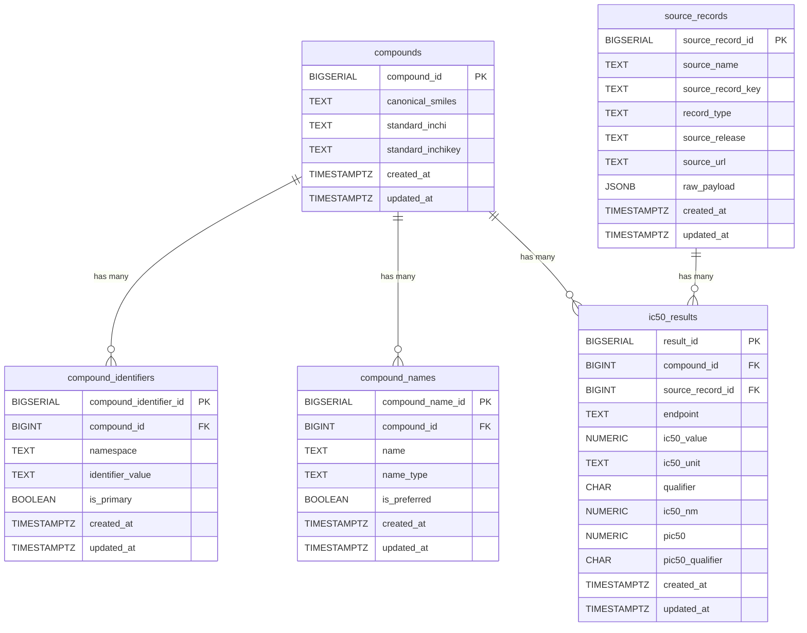

# hERG IC50 Database

Minimal SQL-first system for storing hERG IC50 data with:
- PostgreSQL database
- Normalized compound identifiers + names + provenance
- Database-derived `ic50_nm`, `pIC50`, and `pIC50` qualifier
- Minimal Streamlit frontend for data entry and browsing

## 1. What This Repository Contains

```text
.
|-- docker-compose.yml
|-- .env.example
|-- deploy/
|   `-- Caddyfile
|-- db/
|   `-- init/
|       `-- 001_schema.sql
`-- app/
    |-- Dockerfile
    |-- requirements.txt
    |-- app.py
    |-- herg/
    |   |-- __init__.py
    |   |-- models.py
    |   |-- normalization.py
    |   |-- db.py
    |   |-- ingest_common.py
    |   |-- chembl_ingest.py
    |   `-- pubchem_ingest.py
    `-- scripts/
        |-- ingest_chembl_herg.py
        `-- ingest_pubchem_herg.py
```

## 2. Normalized Schema

Five core tables:
- `compounds`
  - `compound_id` (PK)
  - `canonical_smiles`, `standard_inchi`, `standard_inchikey`
  - `created_at`, `updated_at`
- `compound_identifiers`
  - `namespace`, `identifier_value`, `is_primary`
  - normalized identifier value stored automatically
- `compound_names`
  - preferred name + aliases
  - normalized name stored automatically
- `source_records`
  - structured provenance for every ingested row
- `ic50_results`
  - IC50 value, unit, qualifier, endpoint
  - `ic50_nm`, `pic50`, `pic50_qualifier` are generated in the database

Read models:
- `compound_summary_v`
- `ic50_result_summary_v`

Helper functions:
- `register_compound_v2(...)`
- `resolve_compound_id(...)`
- `upsert_source_record(...)`
- `upsert_ic50_result(...)`

Notes:
- InChIKey is first-class (`compounds.standard_inchikey`).
- Ingesters preserve the original source units and qualifiers; the database derives `ic50_nm` and `pIC50`.

### Schema Diagram



## 3. Local Run (Create + Start)

### Prerequisites
- Docker + Docker Compose plugin installed

### Steps
1. Create local environment file:
```powershell
Copy-Item .env.example .env
```
2. Update `.env` if needed (especially `POSTGRES_PASSWORD`).
   - For local-only use, set `APP_DOMAIN=localhost`
3. Build and start services:
```powershell
docker compose up -d --build
```
4. Open the frontend:
- Direct app port: `http://localhost:8501`
- Via domain (after DNS + port-forward setup): `https://<APP_DOMAIN>`

### Check running services
```powershell
docker compose ps
```

### Check database tables
```powershell
docker compose exec db sh -lc 'psql -U "$POSTGRES_USER" -d "$POSTGRES_DB" -c "\dt"'
```

### Check reverse proxy logs
```powershell
docker compose logs -f caddy
```

### Reset note
Init scripts run only on a fresh Postgres data volume. After schema changes, reset with:
```powershell
docker compose down -v
docker compose up -d --build
```

## 4. Basic Workflow in UI

1. Add compounds with identifiers and/or Standard InChIKey
2. Optionally include Standard InChI, Canonical SMILES, preferred name, and aliases
3. Add IC50 results linked to a compound with structured provenance
4. Use `Upload CSV` tab for bulk imports
5. Use `Dashboard` tab to visualize entry counts and distributions
6. Browse/download recent results as CSV

`ic50_nm`, `pIC50`, and `pIC50` qualifier are computed in the database.

## 5. Populate the Database

Use one of the options below depending on data volume.

### Option A: Populate via Frontend UI (small batches)
1. Open `http://localhost:8501`
2. In `Add Compound`, enter identifiers and/or Standard InChIKey, then save
3. In `Add IC50 Result`, choose the compound and enter result fields + provenance
4. Confirm in `Browse Results`

### Option A2: Populate via Frontend CSV Upload (recommended)
1. Open `http://localhost:8501` and go to `Upload CSV`
2. Download CSV templates from the page (optional)
3. Upload compounds file with columns:
   - `a_number, unii, pubchem_cid, chembl_id, standard_inchikey, standard_inchi, canonical_smiles, preferred_name, common_names`
4. Upload IC50 file with columns:
   - `id_type, id_value, ic50_value, ic50_unit, qualifier, source_name, source_record_key, source_release, source_url`
5. Review row-level import summary/errors shown in UI

Notes:
- `common_names` can be pipe-separated (`name1|name2`) or comma-separated.
- `id_type` should match the identifier namespace (for example `chembl_id`, `pubchem_cid`).

Dashboard includes:
- summary metrics (`compounds`, `entries`, `compounds with results`, first/latest entry dates)
- qualifier and unit distributions
- pIC50 and log10(IC50 nM) histograms
- entries-over-time trend and top compounds by entry count

### Option B: Populate with SQL in `psql` (scriptable)
1. Open a database shell:
```powershell
docker compose exec db sh -lc 'psql -U "$POSTGRES_USER" -d "$POSTGRES_DB"'
```
2. Register compounds (auto-assigning `compound_id`):
```sql
SELECT register_compound_v2(
  p_identifiers => '[
    {"namespace": "a_number", "value": "A-0001", "is_primary": true},
    {"namespace": "chembl_id", "value": "CHEMBL545"}
  ]'::jsonb,
  p_names => '[
    {"name": "ethanol", "name_type": "preferred", "is_preferred": true},
    {"name": "ethyl alcohol", "name_type": "alias"}
  ]'::jsonb,
  p_canonical_smiles => 'CCO',
  p_standard_inchikey => 'LFQSCWFLJHTTHZ-UHFFFAOYSA-N'
);

SELECT register_compound_v2(
  p_identifiers => '[
    {"namespace": "pubchem_cid", "value": "1983", "is_primary": true},
    {"namespace": "chembl_id", "value": "CHEMBL112"}
  ]'::jsonb,
  p_names => '[
    {"name": "acetaminophen", "name_type": "preferred", "is_preferred": true},
    {"name": "paracetamol", "name_type": "alias"}
  ]'::jsonb,
  p_standard_inchikey => 'RZVAJINKPMORJF-UHFFFAOYSA-N'
);
```
3. Insert IC50 results with structured provenance:
```sql
WITH src AS (
  SELECT upsert_source_record(
    p_source_name => 'manual',
    p_source_record_key => 'manual:001',
    p_record_type => 'manual_entry',
    p_source_release => NULL,
    p_source_url => NULL,
    p_raw_payload => '{}'::jsonb
  ) AS source_record_id
)
SELECT *
FROM src,
     upsert_ic50_result(
       p_compound_id => resolve_compound_id('chembl_id', 'CHEMBL545'),
       p_source_record_id => src.source_record_id,
       p_endpoint => 'IC50',
       p_ic50_value => 125.0,
       p_ic50_unit => 'nM',
       p_qualifier => '='
     );
```

### Option C: Bulk load from CSV (recommended for larger batches)
1. Create `compounds.csv`:
```csv
a_number,unii,pubchem_cid,chembl_id,standard_inchikey,standard_inchi,canonical_smiles,preferred_name,common_names
A-0001,,702,CHEMBL545,LFQSCWFLJHTTHZ-UHFFFAOYSA-N,,CCO,ethanol,ethyl alcohol|alcohol
```
2. Create `ic50_results.csv`:
```csv
id_type,id_value,ic50_value,ic50_unit,qualifier,source_name,source_record_key,source_release,source_url
chembl_id,CHEMBL545,125,nM,=,manual,manual:001,,
pubchem_cid,1983,0.85,uM,<,literature,paper:smith-2024-table2,,
```
3. Copy CSV files into the DB container:
```powershell
docker compose cp .\compounds.csv db:/tmp/compounds.csv
docker compose cp .\ic50_results.csv db:/tmp/ic50_results.csv
```
4. Open `psql` and run:
```sql
CREATE TEMP TABLE staging_compounds (
  a_number text,
  unii text,
  pubchem_cid text,
  chembl_id text,
  standard_inchikey text,
  standard_inchi text,
  canonical_smiles text,
  preferred_name text,
  common_names text
);

\copy staging_compounds FROM '/tmp/compounds.csv' WITH (FORMAT csv, HEADER true);

SELECT register_compound_v2(
  p_identifiers => jsonb_build_array(
    jsonb_build_object('namespace', 'a_number', 'value', NULLIF(BTRIM(s.a_number), ''), 'is_primary', true),
    jsonb_build_object('namespace', 'unii', 'value', NULLIF(BTRIM(s.unii), ''), 'is_primary', false),
    jsonb_build_object('namespace', 'pubchem_cid', 'value', NULLIF(BTRIM(s.pubchem_cid), ''), 'is_primary', false),
    jsonb_build_object('namespace', 'chembl_id', 'value', NULLIF(BTRIM(s.chembl_id), ''), 'is_primary', false)
  ),
  p_names => COALESCE((
    SELECT jsonb_agg(entry)
    FROM (
      SELECT jsonb_build_object(
        'name', NULLIF(BTRIM(s.preferred_name), ''),
        'name_type', 'preferred',
        'is_preferred', true
      ) AS entry
      WHERE NULLIF(BTRIM(s.preferred_name), '') IS NOT NULL
      UNION ALL
      SELECT jsonb_build_object(
        'name', alias,
        'name_type', 'alias',
        'is_preferred', false
      ) AS entry
      FROM unnest(regexp_split_to_array(COALESCE(s.common_names, ''), '\\|')) AS alias
      WHERE NULLIF(BTRIM(alias), '') IS NOT NULL
    ) entries
  ), '[]'::jsonb),
  p_canonical_smiles => NULLIF(BTRIM(s.canonical_smiles), ''),
  p_standard_inchi => NULLIF(BTRIM(s.standard_inchi), ''),
  p_standard_inchikey => NULLIF(BTRIM(s.standard_inchikey), '')
)
FROM staging_compounds AS s;

CREATE TEMP TABLE staging_ic50 (
  id_type text,
  id_value text,
  ic50_value numeric,
  ic50_unit text,
  qualifier char(1),
  source_name text,
  source_record_key text,
  source_release text,
  source_url text
);

\copy staging_ic50 FROM '/tmp/ic50_results.csv' WITH (FORMAT csv, HEADER true);

WITH src AS (
  SELECT
    s.*, 
    upsert_source_record(
      p_source_name => NULLIF(BTRIM(s.source_name), ''),
      p_source_record_key => NULLIF(BTRIM(s.source_record_key), ''),
      p_record_type => 'csv_import',
      p_source_release => NULLIF(BTRIM(s.source_release), ''),
      p_source_url => NULLIF(BTRIM(s.source_url), ''),
      p_raw_payload => '{}'::jsonb
    ) AS source_record_id
  FROM staging_ic50 s
)
SELECT *
FROM src,
     upsert_ic50_result(
       p_compound_id => resolve_compound_id(src.id_type, src.id_value),
       p_source_record_id => src.source_record_id,
       p_endpoint => 'IC50',
       p_ic50_value => src.ic50_value,
       p_ic50_unit => src.ic50_unit,
       p_qualifier => src.qualifier
     );
```

### Verify loaded data
```sql
SELECT COUNT(*) AS compounds_n FROM compound_summary_v;
SELECT COUNT(*) AS results_n FROM ic50_result_summary_v;
SELECT
  result_id,
  compound_id,
  preferred_name,
  chembl_id,
  pubchem_cid,
  ic50_value,
  ic50_unit,
  qualifier,
  ic50_nm,
  pic50,
  pic50_qualifier,
  source_name,
  source_record_key
FROM ic50_result_summary_v
ORDER BY result_id DESC
LIMIT 10;
```

### Option D: Automated ChEMBL hERG Ingestion Script
Use the included script to pull hERG IC50 data (`CHEMBL240`) from ChEMBL and load it automatically.

1. Rebuild/start services (so script is available in container):
```powershell
docker compose up -d --build
```
2. Dry run first (no DB writes):
```powershell
docker compose exec frontend python /app/scripts/ingest_chembl_herg.py --dry-run
```
3. Run real ingestion:
```powershell
docker compose exec frontend python /app/scripts/ingest_chembl_herg.py
```

What the script does:
- pulls ChEMBL activities for target `CHEMBL240`, type `IC50`
- registers compounds via `register_compound_v2(...)` with ChEMBL identifiers + InChIKey
- stores provenance in `source_records` with `source_record_key=activity:<id>`
- inserts `ic50_results` with source units and qualifiers (no nM conversion in Python)
- does not pre-scan existing rows for idempotence

Useful flags:
```text
--max-activities 1000         # test with subset
--activity-page-size 1000     # API pagination size
--molecule-batch-size 150     # molecule metadata fetch chunk
--target-chembl-id CHEMBL240  # default hERG target
```

Automation:
- Schedule this command weekly/monthly in CI or cron:
```powershell
docker compose exec frontend python /app/scripts/ingest_chembl_herg.py
```

### Option E: Automated PubChem hERG Ingestion Script
Use the included script to pull hERG IC50-like rows from PubChem concise bioactivity data.

1. Rebuild/start services (so script is available in container):
```powershell
docker compose up -d --build
```
2. Dry run first (no DB writes):
```powershell
docker compose exec frontend python /app/scripts/ingest_pubchem_herg.py --dry-run
```
3. Run real ingestion:
```powershell
docker compose exec frontend python /app/scripts/ingest_pubchem_herg.py
```

What the script does:
- reads PubChem concise assay feed for gene symbol `KCNH2`
- filters to `Target GeneID=3757` and `Activity Name` matching `IC50`
- keeps `Activity Value [uM]` and stores it as `ic50_value` with `ic50_unit='uM'`
- registers compounds via `register_compound_v2(...)` using `pubchem_cid` and `InChIKey`
- inserts provenance into `source_records` with `source_record_key=aid:<aid>|sid:<sid>|cid:<cid>`
- does not pre-scan existing rows for idempotence

Useful flags:
```text
--target-gene-symbol KCNH2
--target-gene-id 3757
--activity-name-regex '(?i)\bic50\b'
--max-activities 2000
--cid-batch-size 150
```

Automation:
- Schedule this command weekly/monthly in CI or cron:
```powershell
docker compose exec frontend python /app/scripts/ingest_pubchem_herg.py
```

## 6. Stop, Restart, Reset

Stop containers:
```powershell
docker compose down
```

Restart:
```powershell
docker compose up -d
```

Reset all data (destructive):
```powershell
docker compose down -v
docker compose up -d --build
```

## 7. Deploy Options

### Option A: Single VM (fastest)
1. Install Docker on server
2. Copy repository to server
3. Create `.env`
4. Run:
```bash
docker compose up -d --build
```
5. Reverse-proxy `frontend` (port 8501) with Nginx/Caddy if needed

### Option B: Managed PostgreSQL + App Container
1. Create managed Postgres instance
2. Run `db/init/001_schema.sql` against that instance
3. Deploy `app/` as a container service
4. Set `DB_HOST`, `DB_PORT`, `DB_NAME`, `DB_USER`, `DB_PASSWORD` in the app runtime

## 8. Notes

- SQL scripts in `db/init/` run only when Postgres initializes a fresh data volume.
- Use `compound_summary_v` and `ic50_result_summary_v` for read access.
- This schema stores identifiers and names in normalized tables; avoid adding identifier columns directly to `compounds`.
- DB and Streamlit ports are bound to localhost only; public traffic should go through Caddy.

## 9. Start-to-Finish Demo Deploy on Personal Computer + Domain

This guide is for a short demo where your personal computer hosts the app publicly.

### 1) Prerequisites
- Docker Desktop (Windows/macOS) or Docker Engine (Linux)
- A domain name you control
- Access to your home router (for port forwarding)
- A stable internet connection

### 2) Prepare the project
```powershell
Copy-Item .env.example .env
```

Edit `.env`:
- set a strong `POSTGRES_PASSWORD`
- set `APP_DOMAIN` to your real demo domain, for example `herg-demo.yourdomain.com`
- set `ACME_EMAIL` to your email (recommended for TLS certificate notices)

Example:
```env
POSTGRES_DB=herg
POSTGRES_USER=herg_user
POSTGRES_PASSWORD=replace_with_strong_password
DB_PORT=5432
UI_PORT=8501
APP_DOMAIN=herg-demo.yourdomain.com
ACME_EMAIL=you@yourdomain.com
HTTP_PORT=80
HTTPS_PORT=443
```

### 3) Configure DNS
At your DNS provider:
- create an `A` record for `herg-demo.yourdomain.com`
- point it to your home public IP address

To find your public IP:
```powershell
curl https://api.ipify.org
```

### 4) Configure router port forwarding
Forward these external ports to your computer’s local IP:
- TCP `80` -> `<your_pc_lan_ip>:80`
- TCP `443` -> `<your_pc_lan_ip>:443`
- UDP `443` -> `<your_pc_lan_ip>:443`

Also ensure local firewall allows inbound 80/443.

### 5) Start the stack
```powershell
docker compose up -d --build
docker compose ps
```

### 6) Validate TLS + app reachability
Check Caddy logs:
```powershell
docker compose logs -f caddy
```

When certificate issuance succeeds, open:
- `https://herg-demo.yourdomain.com`

### 7) Demo operation checklist
- ingest data using CSV/UI or scripts
- check dashboard page loads charts
- verify DB connectivity:
```powershell
docker compose exec db sh -lc 'psql -U "$POSTGRES_USER" -d "$POSTGRES_DB" -c "SELECT COUNT(*) FROM ic50_results;"'
```

### 8) Update for another demo session
```powershell
docker compose pull
docker compose up -d --build
```

### 9) Shut down after demo
```powershell
docker compose down
```

### 10) Common issues
- Certificate not issued:
  - DNS still propagating
  - ports 80/443 not forwarded/open
  - domain not pointing to current public IP
- Domain works on Wi-Fi but not mobile:
  - router hairpin NAT behavior; test from cellular network
- No inbound connectivity despite forwarding:
  - ISP may use CGNAT or block inbound ports
  - for quick demos, use a tunnel service (for example Cloudflare Tunnel or Tailscale Funnel)
